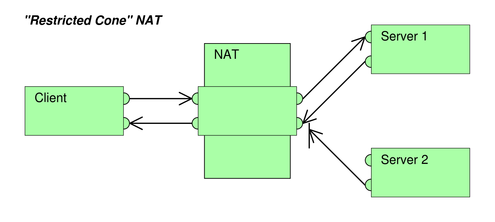
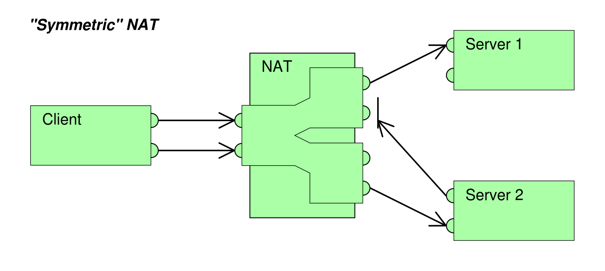

# Web RTC

_This repo serves as an in-depth explanation of Web RTC._

To see webRTC in action, navigate to the [demo](https://github.com/jaqarrick/webrtc-info/tree/main/demo) folder and follow along with the enclosed [readme](https://github.com/jaqarrick/webrtc-info/blob/main/demo/readme.md).

## Overview

Web RTC stands for Web Real-Time Communication. It standardizes and simplifies a method for two or more peers to communicate directly with each other in an efficient and low latency manner.

**How does it work?**

1. PeerA wants to Connect to PeerB
2. PeerA finds out all possible ways the public can connect to it
3. PeerB finds out all possible ways the public can connect to it
4. PeerA and PeerB signal this session information (SDP/Session Description Protocol) via other means (through something like WebSockets, HTTP Fetch, etc.)
5. PeerA connects to PeerB via the most optimal path
6. PeerA & PeerB also exchange supported media and security

## Inner Mechanisms of Web RTC Demystified

### NAT (Network Address Translation)

Almost all devices that are connected to the internet live behind [NAT](https://en.wikipedia.org/wiki/Network_address_translation), which allows for private IPs to be translated into a public IP (which is provided by a router).

1. Let's say my private IP address is 10.0.0.2 and the IP address I want to reach is 4.4.4.4:80 (which could be an AWS server, for example). First, I'd construct a packet with the following information:
   - **8992 | 10.0.0.2 | GET/ | 4.4.4.4 | 80**
2. First my router will check if the destination address is directly available through subnet masking. Because these two addresses are clearly not on the subnet range, it knows it cannot be communicated with directly.
3. The router, who's public IP address is 5.5.5.5, will replace the source IP on the packet with its IP address and distinct, random port. The packet now looks like this:

   - **3333 | 5.5.5.5 | GET/ | 4.4.4.4 | 80**

   This is also understood as a _NAT Table_:
   Internal IP | Internal Port | Ext. IP | Ext. Port | Dest. IP | Destination Port |
   ----- | ----- | ----- | ----- | -----| ----- |
   10.0.0.2 | 8992 | 5.5.5.5 | 3333 | 4.4.4.4 | 80

   The destination responds with the following packet:

   - **80 | 4.4.4.4 | 200 OK | 10.0.0.2 | 8992**

   The router refers to the NAT table on where to send the packet in the local network.

### NAT Translation Methods

Each router has a different implementation of NAT:

1. **One to One NAT (Full-cone NAT)**
2. **Address restricted NAT**
3. **Port restricted NAT**
4. **Symmetric NAT** (Not compatible with web RTC)

#### One to One NAT (Full Cone NAT)

Packets to external IP:port on the router always maps to internal IP:port without exceptions.
Internal IP | Internal Port | Ext. IP | Ext. Port | Dest. IP | Destination Port |
----- | ----- | ----- | ----- | -----| ----- |
10.0.0.2 |8992|5.5.5.5|3333|4.4.4.4|80|
10.0.0.2|9999|5.5.5.5|4444|3.3.3.3|80

Any packet directed to 5.5.5.5:3333 will automatically route to the internal address 10.0.0.2:9999.


#### Address restricted NAT

Packets to external IP:port on the router always maps to internal IP:port as long as source address from packet matches the table - regardless of port. Packets are allowed if previous communication has occurred.

##### Consider the following example:

_Assume we have the NAT table below_

| Internal IP | Internal Port | Ext. IP | Ext. Port | Dest. IP | Destination Port |
| ----------- | ------------- | ------- | --------- | -------- | ---------------- |
| 10.0.0.2    | 8992          | 5.5.5.5 | 3333      | 4.4.4.4  | 80               |
| 10.0.0.2    | 9999          | 5.5.5.5 | 4444      | 3.3.3.3  | 80               |

_And the following packets_

80 | 4.4.4.4 | 200 OK | 5.5.5.5 | 3333
22 | 3.3.3.3 | 200 OK | 5.5.5.5 | 3333
8080 | 3.3.3.3 | 200 OK | 5.5.5.5 | 3333
23 | 9.8.1.2 | 200 OK | 5.5.5.5 | 3333

The first three packets would be accepted because both 3.3.3.3 and 4.4.4.4 are on our NAT table

**80 | 4.4.4.4 | 200 OK | 5.5.5.5 | 3333
22 | 3.3.3.3 | 200 OK | 5.5.5.5 | 3333
8080 | 3.3.3.3 | 200 OK | 5.5.5.5 | 3333**
23 | 9.8.1.2 | 200 OK | 5.5.5.5 | 3333 (not accepted)



#### Port restricted NAT

Very similar to Address Restricted NAT, but requires PORTS, along with IP, to match NAT table. In our example above, following Port Restricted NAT, only the following packets would be accepted:

**80 | 4.4.4.4 | 200 OK | 5.5.5.5 | 3333**
22 | 3.3.3.3 | 200 OK | 5.5.5.5 | 3333 (not accepted)
8080 | 3.3.3.3 | 200 OK | 5.5.5.5 | 3333 (not accepted)
23 | 9.8.1.2 | 200 OK | 5.5.5.5 | 3333 (not accepted)


#### Symmetric NAT

Packets to external IP:port on router always maps to internal IP:port as long as source address and port from packet exactly matches the table.



This method is incompatible with webRTC because it requires a higher level of verification and doesn't allow for STUN.

### STUN (Session Traversal Utilities for NAT)

A collection of utilities, one of which tells a client the public IP/Port through NAT. STUN is compatible with Full-cone, Port/Address restricted NAT, but doesn't work with Symmetric NAT.

- Usually runs on port 3478, or 5349 for TLS
- Cheap to maintain

#### How a STUN request works:

1. Create a packet from private IP/Port (10.0.0.2:8992) that requests STUN / STN from a STUN server (9.9.9.9:3478)
   - 8992 | 10.0.0.2 | STN | 9.9.9.9 | 3478
2. Router performs NAT, translates private IP/Port to public IP/Port (5.5.5.5:3333) and sends packet to STUN server
   - 3333 | 5.5.5.5 | STN | 9.9.9.9 | 3478
3. STUN sends packet back to public IP, which contains a response/RSP showing public IP port of client
   - 3478 | 9.9.9.9 | RSP | 5.5.5.5 | 3.3.3.3

If two peers both receive public IP/Port from STUN server and try to connect, they will run into issues if either of them are using Symmetric NAT. An incomming IP address that isn't recognized wont be allowed. The way to solve this issue of is through TURN.

### TURN (Traversal Using Relays around NAT)

TURN is used in the case of Symmetric NAT, which is a server that relays packets.

- Usually runs on port 3478, or 5349 for TLS
- It's expensive to maintain and run.

### [ICE](https://developer.mozilla.org/en-US/docs/Web/API/RTCIceCandidate) (Interactive Connectivity Establishment)

A protocol that collects all available candidates (local IP addresses, reflexive addresses - STUN/TURN), which are called ICE candidates. All the collected are sent to remote peer via SDP. When starting a WebRTC peer connection, typically a number of candidates are proposed by each end of the connection, until they mutually agree upon one which describes the connection they decide will be best. WebRTC then uses that candidate's details to initiate the connection.

### SDP (Session Description Protocol)

A format that describes ICE candidates, networking options, media options, security options, and tons of other stuff. More of a format than a protocol. _SDP is the most important concept in WebRTC._ The goal of SDP is to take the SDP generated by a user and send it to the other party. Sending SDP can be sent using a number of ways (Sockets, HTTP Fetch, WhatsApp :))

```
Session description
    v=  (protocol version number, currently only 0)
    o=  (originator and session identifier : username, id, version number, network address)
    s=  (session name : mandatory with at least one UTF-8-encoded character)
    i=* (session title or short information)
    u=* (URI of description)
    e=* (zero or more email address with optional name of contacts)
    p=* (zero or more phone number with optional name of contacts)
    c=* (connection information—not required if included in all media)
    b=* (zero or more bandwidth information lines)
    One or more Time descriptions ("t=" and "r=" lines; see below)
    z=* (time zone adjustments)
    k=* (encryption key)
    a=* (zero or more session attribute lines)
    Zero or more Media descriptions (each one starting by an "m=" line; see below)

    v=0
    o=jdoe 2890844526 2890842807 IN IP4 10.47.16.5
    s=SDP Seminar
    i=A Seminar on the session description protocol
    u=http://www.example.com/seminars/sdp.pdf
    e=j.doe@example.com (Jane Doe)
    c=IN IP4 224.2.17.12/127
    t=2873397496 2873404696
    a=recvonly
    m=audio 49170 RTP/AVP 0
    m=video 51372 RTP/AVP 99
    a=rtpmap:99 h263-1998/90000
```

### Signaling

A method to send SDP to another party or client that we want to communicate with.

## Attribution

This guide draws heavily from Hussein Nasser's [WebRTC crash course](https://www.youtube.com/watch?v=FExZvpVvYxA). The demo loosely follows examples from Baeldung's [Guide to WebRTC](https://www.baeldung.com/webrtc), Google's webRTC [codelab](https://codelabs.developers.google.com/codelabs/webrtc-web), and ScaleDrone's [WebRTC Tutorial](https://www.scaledrone.com/blog/webrtc-tutorial-simple-video-chat/). The images are sourced from the Wikimedia Commons and licenced under the Creative Commons Attribution-Share Alike 3.0 Unported license.
